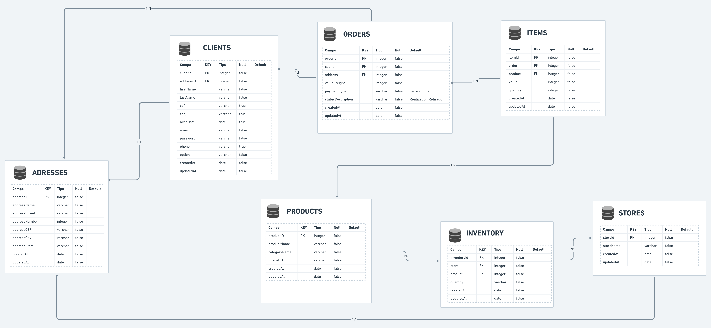
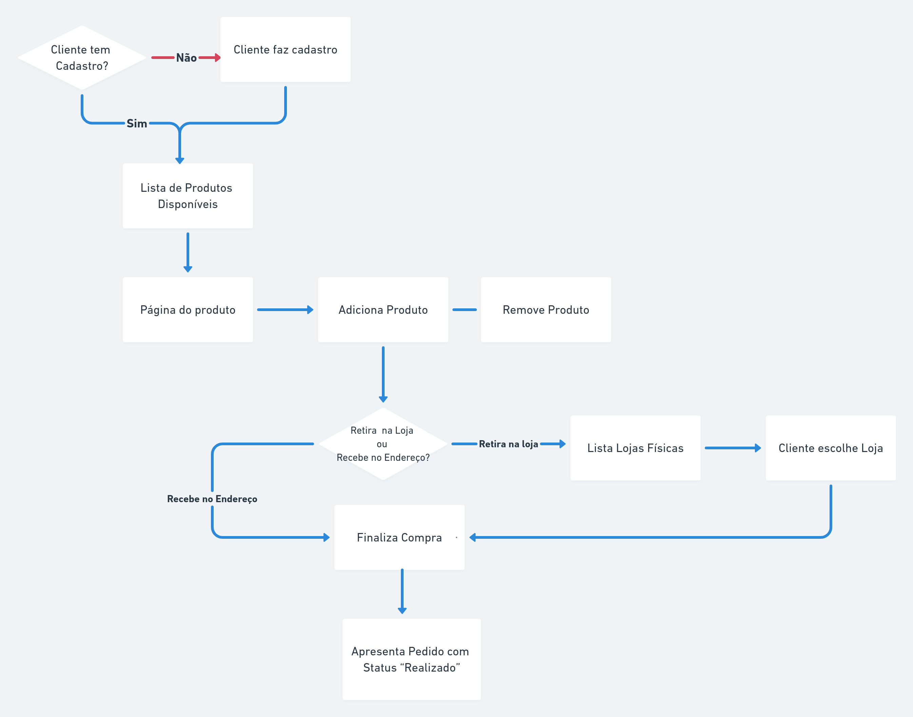

## **Projeto Final LuizaCode: Omni Channel**

## SUMÁRIO

1. [Equipe](#Equipe)
2. [Introdução](#INTRODUÇÃO)
3. [Arquitetura](#ARQUITETURA)
4. [Tecnologias](#TECNOLOGIAS_UTILIZADAS)
5. [Infraestrutura](#INFRAESTRUTURA)
6. [Setup Local](#SETUP_LOCAL)
7. [Considerações de desenvolvimento](#CONSIDERAÇÕES_DESENVOLVIMENTO)

## ``Equipe``

``NaN (Not a Name)``
#  
|     Desenvolvedora      |    GitHub     |   LinkedIn   |
|-------------------------|---------------|--------------|
|👤 Bianca da Silva Gonçalves|https://github.com/bianksilva|https://www.linkedin.com/in/bianca-silva-goncalves/|
|👤 Camila Vieira Ferrari Correia|https://github.com/milabixcode|https://www.linkedin.com/in/camila-ferrari/|
|👤 Chauana Januario de Oliveira|https://github.com/Chauana|https://www.linkedin.com/in/chauana-januario-a00052156/|
|👤 Elis Nunes|https://github.com/Elis-Carmezim|https://www.linkedin.com/in/elis-nunes/|
|👤 Laura Xavier Pereira|https://github.com/lauraxavierr|https://www.linkedin.com/in/laura-x-997964117/|

<br>

## ``INTRODUÇÃO``

O objetivo dessa integração é 
desenvolver um serviço HTTP resolvendo a funcionalidade de
Omnichannel do cliente. Esse serviço atendem os seguintes requisitos:
- Adicionar um produto na lista da compra da cliente;
- Remover um produto da lista da compra da cliente;
- Consultar todos os produtos disponíveis;
- Consultar a lista de compras da cliente;

<br>

## ``ARQUITETURA``
BANCO DE DADOS



<br>

FLUXO DE NAVEGAÇÃO


<br>

``DESAFIO PROPOSTO``
-> readme-assents/Desafio-Final.pdf

<br>


### ``TECNOLOGIAS_UTILIZADAS``


* **Banco de dados:** `ElephantSQL`
* **API Client:** `Insomnia`
* **Conexão com o Banco de Dados:** `PostBird`
* **Editor/IDE:** `Visual Studio Code`

<br>

## ``INFRAESTRUTURA``


<br>

## ``SETUP_LOCAL``


1. No seu terminal, baixe o projeto através do comando:
```
git clone
```

2. Entre na pasta do projeto: 
```
cd omniChannel_LuizaCode
```

3. Instale o NodeJs:
No Linux:
```
sudo apt-get install nodejs
```

4. Configurar a conexão com o Banco de Dados
no arquivo database.js, que está na pasta config:
```
Nos campos "host", "username", password" e "database" insira as informações do Banco de Dados o qual pretende-se conectar.
```

5. A conexão com o Banco de Dados uma vez configurada, execute o migration para garantir a consistência dos dados:
```
npx sequelize db:migrate 
```
6. No terminal, navegue até a pasta raiz do projeto e execute o comando para subir a aplicação localmente:
```
npm run dev
```

7. Para alterar a porta do servidor:
```
Edite o arquivo server.js dentro da pasta src
```

<br>

## ``CONSIDERAÇÕES_DESENVOLVIMENTO``

Link para repositório do frontend:
https://github.com/milabixcode/luiza-coders-frontend-react.git
